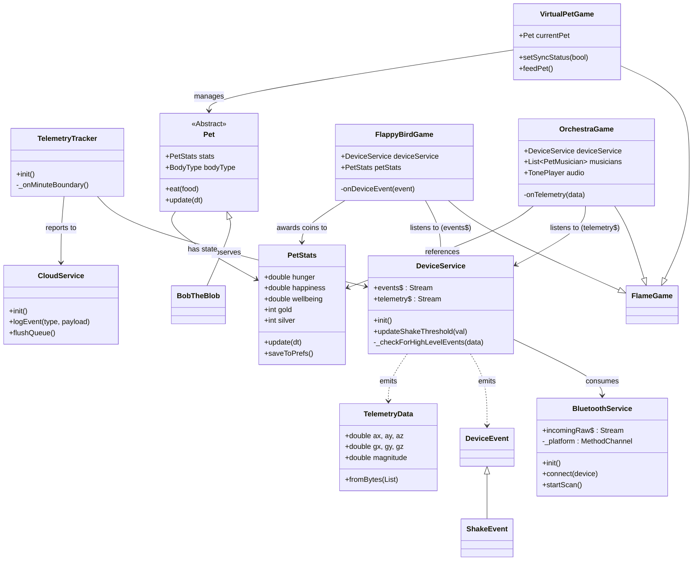

# Therapets (Sync Companion)

A Flutter-based virtual pet app that uses a custom BLE hardware companion (M5-IMU-Sensor) to bring your pet to life through motion controls and real-time telemetry.

## Download Builds

| Channel | Build Type | Download Link |
| :--- | :--- | :--- |
| **Stable** | `Production` | [](https://github.com/StrawberryFrappe/Therapets/releases/latest/download/app-release.apk) |
| **Nightly** | `Development` | [](https://github.com/StrawberryFrappe/Therapets/releases) |
| **Unstable** | `Experimental` | [](https://github.com/StrawberryFrappe/Therapets/releases) |

---

**Supports two hardware variants:**
- **MAX30100**: Pulse Oximeter + IMU
- **GY906**: IR Temperature Sensor + IMU

## Architecture



### Service Layer
| Service | Role | Output |
|---------|------|--------|
| `BluetoothService` | Low-level BLE manager (scan, connect, foreground service) | `incomingRaw$` (bytes) |
| `DeviceService` | High-level abstraction (parses bytes, detects gestures) | `telemetry$` (sensor data), `events$` (ShakeEvent, etc.) |
| `CloudService` | Cloud connectivity & event queueing (ThingsBoard) | HTTP Telemetry |
| `TelemetryTracker` | Aggregates data & tracks sessions | `sync_status`, `mission_completed` events |

### Game Layer (Flame Engine)
| Component | Description |
|-----------|-------------|
| `VirtualPetGame` | Main screen. Renders the pet (`BobTheBlob`) and manages sync status. |
| `Pet` / `PetStats` | Tamagotchi-style logic: hunger, happiness, currency, persistence. |
| `FlappyBirdGame` | Action game. Listens to **discrete events** (`ShakeEvent`) to jump. Awards Silver coins. |
| `OrchestraGame` | Creative tool. Listens to **continuous telemetry** to map tilt to pitch/volume. |

### Supported Devices
The app automatically detects the connected device type based on the BLE packet size (Sticky detection):

| Device Variant | Sensor | Packet Size | Features |
|----------------|--------|-------------|----------|
| **MAX30100** | Pulse Oximeter | 16 bytes | BPM, SpO2, Heartbeat Waveform |
| **GY906** | IR Thermometer | 14 bytes | Body Temperature, Trend Waveform |

*Both variants include 6-axis IMU data (Accelerometer + Gyroscope).*

## Project Structure
```text
lib/
├── main.dart               # App entry point
├── core/                   # Bootstrapping & Lifecycle
├── services/
│   ├── device/             # Low-level BLE & Signal Processors
│   ├── cloud/              # Cloud connectivity & Telemetry tracking
│   ├── notifications/      # Foreground service & local notifications
│   ├── locale_service.dart # i18n localization service
│   └── update_service.dart # OTA or app updates
├── game/
│   ├── virtual_pet_game.dart    # Main pet game
│   ├── bob_the_blob.dart        # Pet implementation
│   ├── pets/                    # Pet base classes & stats
│   └── minigames/
│       ├── flappy_bird/         # Flappy Bird minigame
│       └── orchestra/           # Pet Orchestra minigame
└── screens/                     # Flutter UI screens
    ├── pulse_oximeter/          # MAX30100 UI
    └── temperature_sensor/      # GY906 UI
```

## Quick Start
```powershell
flutter pub get
flutter run -d <device-id>
```

## Development Status

### Current Stage: Stage 5 — Multilingual Support ✅
*Completed: Added English and Spanish localization with automatic device language detection and manual language switching via flag buttons in Settings.*

### Stage History
| Stage | Focus | Status |
|-------|-------|--------|
| 1 | **Connectivity** — Background BLE stability | ✅ Complete |
| 2 | **Virtual Pet Base** — Hunger, Happiness, Currency | ✅ Complete |
| 3 | **Telemetry Minigames** — Motion-controlled games | ✅ Accomplished |
| 4 | **Cloud Connectivity** — Mission system + cloud sync | ✅ Accomplished |
| 5 | **Multilingual Support** — English + Spanish with device language detection | ✅ Complete |

## Configuration

To enable cloud telemetry:
1. Go to **Settings** > **Advanced Settings**.
2. Enter your **Cloud Base URL** (e.g., `http://YOUR_THINGSBOARD_IP:8080`).
3. Enter your **Device Token**.
4. The app will automatically start queuing and sending data when connected.
