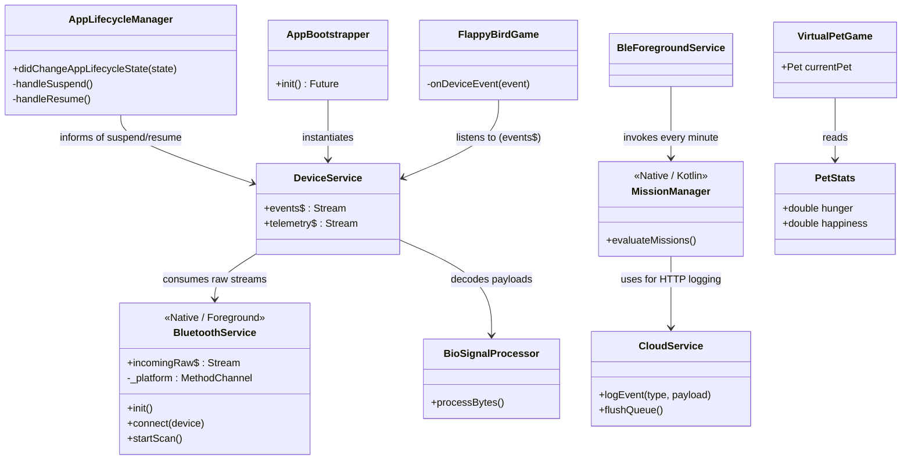

# Therapets Architecture Mapping

## Core Systems & Data Flow

The architecture of Therapets is strictly divided into layers, ensuring that the Flutter UI and Flame Game Engine are decoupled from low-level hardware intricacies.

## Service Layer Breakdown
1. **`lib/services/device/`**:
   - `bluetooth_service.dart`: Low-level BLE management (scanning, connecting, MethodChannels to Foreground Service).
   - `device_service.dart`: High-level abstraction. Emits clean `events$` and `telemetry$`.
   - `bio_signal_processor.dart` & `temperature_signal_processor.dart`: Decode raw byte payloads based on the connected hardware variant.
2. **`lib/services/cloud/`**:
   - `cloud_service.dart`: Manages the HTTP queue for Thingsboard.
3. **`lib/services/notifications/`**:
   - Manages the interaction with the `FlutterForegroundTask` plugin for the `therapets_fg` channel.
4. **Native Android (`app/src/main/kotlin/`)**:
   - `BleForegroundService.kt`: Handles BLE connection and background telemetry bridging.
   - `CloudManager.kt`: Native HTTP poster for background syncing.
   - `MissionManager.kt`: Native JSON Mission Engine that evaluates metric goals natively to survive Flutter Engine suspension.

## Unified Sync State (Source of Truth)
- The **Native Android foreground service (`BleForegroundService`)** is the absolute source of truth for connection state.
- Flutter `DeviceService.onAppResumed()` must **NEVER** overwrite or nuke state; it must read the canonical state from Native.
- Refer to `AGENTS.md` for specific handling of the **10-second IoT sleep cycle** and the **15-second Grace Window**.
