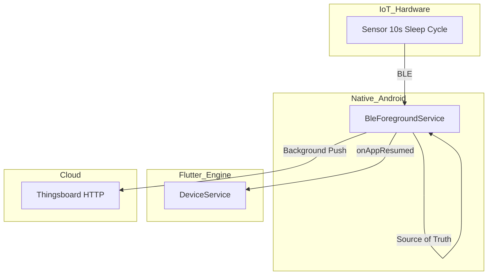

# Arquitectura y Sincronización (Sync State Vision)

Esta sección documenta la auditoría de Abril 2026 sobre el "Sync State".

El "Sync State" dicta la telemetría de la nube, la visualización de la UI y las misiones diarias. Actúa como puente entre las limitaciones del hardware (ciclos de sueño de los sensores IoT de 10s) y las restricciones del OS móvil.

## Casos de Uso del Sync

1. **Lecturas Deficientes / Ciclo de Sueño (10s)**
   - *Trigger:* BLE conectado, `humanDetected` pasa a false.
   - *Acción:* Ventana de gracia de 15s. Se mantiene en el historial el *último estado registrado*.
   - *Resultado:* Evita desconexiones por ciclos de sueño del hardware.
2. **Dispositivo en Reposo (Sin Humano)**
   - *Trigger:* Expira la ventana de gracia.
   - *Acción:* Se empuja `false` al historial. Se detiene el conteo de misiones y los logs a la nube.
3. **Desconexión del Dispositivo (Corte BLE)**
   - *Trigger:* Pérdida de conexión.
   - *Acción:* La UI se congela hasta por 30s ("esperando"). Si se reconecta, la UI reanuda. Si no, se limpia la historia de la UI.
   - *Aclaración:* El historial de la nube NO se congela, se registra como `false` (0s sincronizados) sin falsear datos.

## Mandato Arquitectónico

- **Native Foreground Service:** El servicio de Android en primer plano (`BleForegroundService`) es la fuente principal de la verdad.
- **Flutter Lifecycle:** El método `DeviceService.onAppResumed()` de Flutter NUNCA debe borrar el estado, debe leer el estado canónico desde la parte Nativa.
- **Nube:** Los envíos (Thingsboard HTTP) y conteos de misión se ejecutan en Nativo para sobrevivir la suspensión del motor de Flutter.

