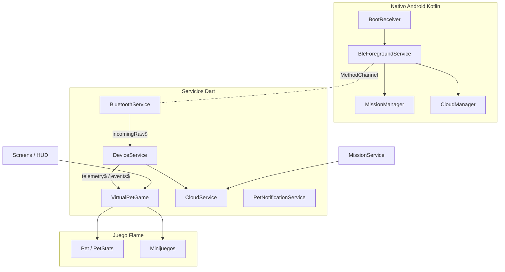
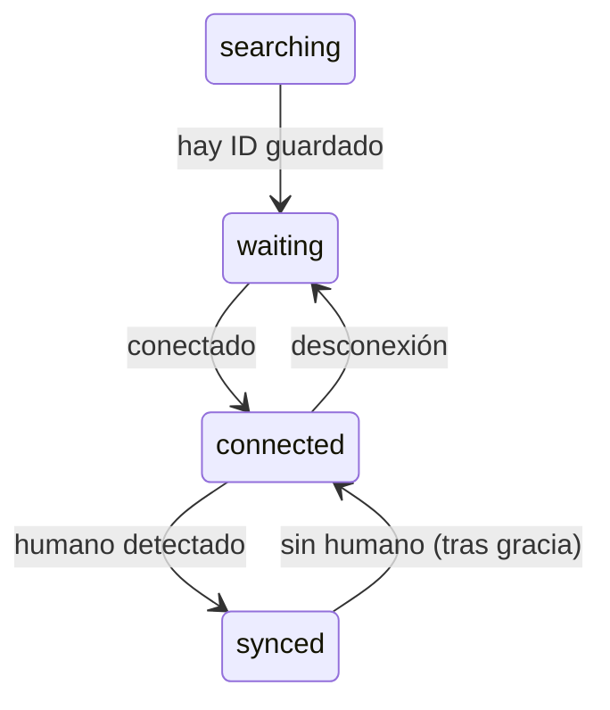

# Arquitectura
{: .no_toc }

1. TOC
{:toc}

Therapets es una app **Flutter** con una capa nativa **Android (Kotlin)** para el
trabajo en segundo plano. El flujo es: **Bluetooth → abstracción de dispositivo →
lógica de juego → UI**, con una capa transversal de **persistencia y nube**.

## Capas

```mermaid
graph TD
    subgraph Nativo Android Kotlin
      BFS[BleForegroundService] --> MM[MissionManager]
      BFS --> CM[CloudManager]
      BR[BootReceiver] --> BFS
    end
    subgraph Servicios Dart
      BT[BluetoothService] -->|incomingRaw$| DS[DeviceService]
      DS -->|telemetry$ / events$| GAME
      CS[CloudService]
      NS[PetNotificationService]
    end
    subgraph Juego Flame
      GAME[VirtualPetGame] --> PET[Pet / PetStats]
      GAME --> MINI[Minijuegos]
    end
    UI[Screens / HUD] --> GAME
    BFS -. MethodChannel .- BT
    DS --> CS
    MS[MissionService] --> CS
```

| Capa | Componentes clave | Ubicación |
|------|-------------------|-----------|
| Entrada | `main.dart`, `BootstrapWrapper`, `TherapetsApp` | `lib/main.dart` |
| Bootstrap | `AppBootstrapper`, `AppLifecycleManager` | `lib/core/` |
| Dispositivo (BLE) | `BluetoothService`, `DeviceService`, procesadores de señal | `lib/services/device/` |
| Nube | `CloudService`, `CloudEvent`, `EventQueue` | `lib/services/cloud/` |
| Juego | `VirtualPetGame`, `Pet`, `PetStats`, minijuegos | `lib/game/` |
| UI | `GameScreen`, HUD, menús, ajustes | `lib/screens/` |
| Nativo | `BleForegroundService`, `MissionManager`, `CloudManager`, `BootReceiver`, `MainActivity` | `android/app/src/main/kotlin/com/strawberryFrappe/sync_companion/` |

## Inyección de dependencias

Se usa **`provider`**. Los servicios se construyen e inicializan en
`AppBootstrapper` (`lib/core/app_bootstrapper.dart`) y se inyectan en el árbol:
`CloudService`, `DeviceService`, `MissionService`, `PetStats`,
`PetNotificationService` y `LocaleService` (este último como `ChangeNotifierProvider`).

## Ciclo de vida

`AppLifecycleManager` (`lib/core/app_lifecycle_manager.dart`) engancha el ciclo de
vida de Flutter:

- **pause/resume:** guarda estadísticas; al volver, `DeviceService.onAppResumed()`
  re-engancha el `EventChannel` nativo y pide el estado canónico al servicio.
- **Hidratación en segundo plano:** `PetStats.applyBackgroundUpdates()` y
  `MissionService.rehydrateBackgroundProgress()` recalculan el tiempo transcurrido
  mientras la app estuvo cerrada, usando el reloj y el último timestamp guardado.

## Estado de sincronización (display status)

`DeviceService` (`lib/services/device/device_service.dart`) expone `displayStatus$`
con cuatro estados (`synced`, `connected`, `waiting`, `searching`). La lógica vive
en `DeviceStatusAggregator` (`device_status_aggregator.dart`), que combina:

- estado de conexión nativo (sobrevive reinicios de UI),
- **liveness**: telemetría reciente (< 3 s),
- detección de humano (según el procesador del tipo de sensor),
- una **ventana de gracia** para no romper *synced* por parpadeos breves,
- si hay un minijuego en curso.

```mermaid
stateDiagram-v2
    searching --> waiting: hay ID guardado
    waiting --> connected: conectado
    connected --> synced: humano detectado
    synced --> connected: sin humano (tras gracia)
    connected --> waiting: desconexión
```

## Detección del tipo de sensor

Es **pegajosa** (*sticky*): el primer paquete fija el tipo y no cambia hasta
desconectar (`DeviceService.init()`):

- 16 bytes → `DeviceType.max30100`
- 14 bytes → `DeviceType.gy906`

Ver [Capa BLE y Protocolo](ble_protocolo.html) para el formato de paquetes.
