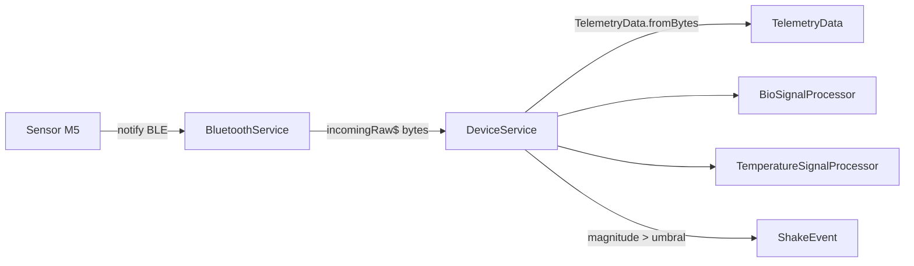

# Capa BLE y Protocolo
{: .no_toc }

1. TOC
{:toc}

## Pipeline

- `BluetoothService` (`lib/services/device/bluetooth_service.dart`): escaneo,
  conexión, reconexión y puente con el servicio nativo (MethodChannel /
  EventChannel). Emite los bytes crudos en `incomingRaw$`.
- `DeviceService` (`device_service.dart`): parsea bytes a `TelemetryData`, fija el
  tipo de sensor, enruta al procesador correcto y emite `telemetry$` / `events$`.

## Formato de paquete

Todos los enteros son **int16 little-endian** salvo los campos de vitales
(uint16). Lógica en `TelemetryData.fromBytes()`
(`lib/game/models/telemetry_data.dart`). Tamaños válidos: **12, 14 o 16 bytes**.

| Offset | Campo | Tipo | Escala | Unidad |
|:------:|-------|------|--------|--------|
| 0 | aX | int16 LE | `/ 1000` | g |
| 2 | aY | int16 LE | `/ 1000` | g |
| 4 | aZ | int16 LE | `/ 1000` | g |
| 6 | gX | int16 LE | `/ 10` | °/s |
| 8 | gY | int16 LE | `/ 10` | °/s |
| 10 | gZ | int16 LE | `/ 10` | °/s |

Extensión según tamaño:

| Tamaño | Variante | Campos extra |
|:------:|----------|--------------|
| **12** | — (solo IMU) | ninguno |
| **14** | GY906 | `rawTemp` = **uint16 LE** @12 |
| **16** | MAX30100 | `rawIr` = uint16 LE @12, `rawRed` = uint16 LE @14 |

**Temperatura (GY906):** `°C = rawTemp * 0.02 - 273.15` (fórmula del datasheet).
`rawTemp == 0` ⇒ sensor desconectado/erróneo.

## Detección del tipo de sensor (sticky)

En el primer paquete con datos válidos (`DeviceService.init`):

- 16 bytes ⇒ `max30100`
- 14 bytes ⇒ `gy906`

El tipo permanece fijo hasta la desconexión, momento en que se resetea a `unknown`
y se reinician los procesadores.

## Filtros anti-corrupción

El hardware IoT genera ruido/spikes. Filtros aplicados:

| Filtro | Dónde | Regla |
|--------|-------|-------|
| Magnitud IMU | `TelemetryData.fromBytes` | rechaza paquete si `|accel| > 10.0 g` |
| Spike de IR | `BioSignalProcessor.process` | descarta si `|ΔrawIr| > 20000` (hasta 50 seguidos) |
| Error de sensor IR | `BioSignalProcessor` | `rawIr/rawRed == 65535 (0xFFFF)` ⇒ desconectado |
| Error de temperatura | `TemperatureSignalProcessor` | `rawTemp == 0` ⇒ desconectado |

## Detección de gestos

`DeviceService._checkForHighLevelEvents`: si `magnitude > _shakeThreshold`
(por defecto **2.5**, ajustable) emite un `ShakeEvent`. Lo consume *Flappy Bob*.
La telemetría continua (inclinación) la consume *Orchestra*.

## Procesamiento de bio-señal (MAX30100)

`BioSignalProcessor` (`bio_signal_processor.dart`) replica la librería de
referencia Arduino-MAX30100:

- **Filtros:** `DCRemover` (α=0.95) + Butterworth paso-bajo de orden 1
  (Fs=100 Hz, Fc=6 Hz).
- **Detección de latido:** máquina de estados (`init → waiting → followingSlope →
  maybeDetected → masking`) con umbral adaptativo.
- **BPM:** `60000 / periodoLatido`, limitado a **30–220**.
- **SpO₂:** ratio log de las sumas AC² de RED/IR contra una **LUT** (referencia TI),
  cada 4 latidos. Rango fisiológico **70–100 %**.
- **Detección de dedo:** histéresis (ON si IR > 5000, OFF si IR < 3000).
- **Humano detectado:** dedo + BPM válido (40–200) + SpO₂ ≥ 85 % + presencia
  sostenida (~0,5 s) + BPM estable.
- **Pre-seed:** el servicio nativo puede precargar BPM/SpO₂ para saltar el warm-up.

## Procesamiento de temperatura (GY906)

`TemperatureSignalProcessor` (`temperature_signal_processor.dart`):

- Convierte raw→°C, mantiene buffer de forma de onda (~5 s @100 Hz) e historial.
- **Humano detectado:** °C en **29,7–41** sostenido **50 muestras** (0,5 s).
- Guarda la **última lectura válida** con timestamp (fresca hasta 60 s).

## Pruebas

`test/telemetry_decoder_test.dart`, `test/device_status_aggregator_test.dart`,
`test/last_reading_retention_test.dart` cubren el decodificado de paquetes
(12/14/16 B), las heurísticas de corrupción y la agregación de estado.
