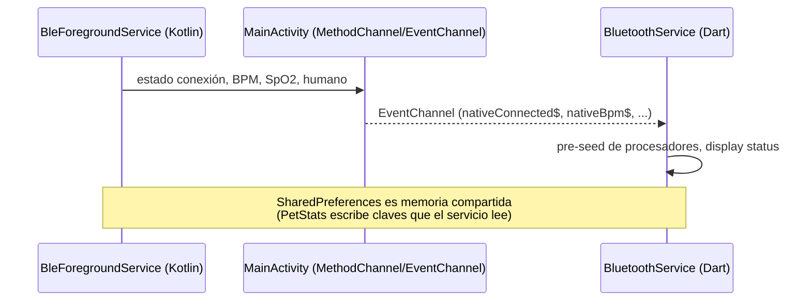

# Capa Nativa Android (Kotlin)
{: .no_toc }

1. TOC
{:toc}

Flutter se suspende cuando la app pasa a segundo plano, pero el BLE debe seguir
vivo. Por eso la conexión y la lógica crítica viven en un **servicio nativo
Kotlin**. Archivos en
`android/app/src/main/kotlin/com/strawberryFrappe/sync_companion/`.

## Componentes

| Archivo | Rol |
|---------|-----|
| `MainActivity.kt` | Entrada Flutter; expone `MethodChannel`/`EventChannel` para hablar con Dart. |
| `BleForegroundService.kt` | Servicio *foreground* que mantiene la conexión BLE persistente y procesa telemetría aunque la UI esté muerta. |
| `MissionManager.kt` | Evalúa el progreso de misiones en nativo (sobrevive a la suspensión de Flutter). |
| `CloudManager.kt` | Encola y agrega telemetría por minuto del lado nativo. |
| `BootReceiver.kt` | Recibe `BOOT_COMPLETED` y reanuda el servicio al arrancar el teléfono. |

## Por qué nativo

- Android mata isolates de Flutter en segundo plano; un **foreground service**
  con notificación persistente no.
- La agregación de telemetría por minuto y la evaluación de misiones se movieron a
  nativo para no perder datos durante suspensiones largas.

## Servicio foreground

Declarado en `AndroidManifest.xml`:

```xml
<service android:name=".BleForegroundService"
         android:foregroundServiceType="dataSync"
         android:stopWithTask="false" />
```

- `stopWithTask="false"`: sigue corriendo aunque el usuario cierre la app desde
  recientes.
- Tipos de servicio: `dataSync` (nativo) y `connectedDevice` (plugin
  `flutter_foreground_task`).
- **Ventana de gracia (~15 s):** lecturas malas momentáneas no tiran la conexión.
- **Filtros de corrupción** equivalentes a los de Dart (magnitud, delta de IR) para
  no contaminar la agregación.

## Puente Dart ↔ Nativo



- `DeviceService` escucha `nativeConnected$`, `nativeBpm$`, `nativeSpo2$`,
  `nativeHumanDetected$` y **prioriza el estado nativo** porque sobrevive a
  reinicios de la UI.
- Al volver del segundo plano, `DeviceService.onAppResumed()` re-engancha el
  `EventChannel` y pide el estado canónico.

## Memoria compartida vía SharedPreferences

`PetStats._mirrorToPrefs()` escribe claves individuales
(`pet_hunger`, `pet_happiness`, `pet_last_update`, tasas, umbral) **además** del
bundle JSON, precisamente para que el servicio nativo Kotlin pueda leer y
actualizar el estado de la mascota sin Flutter vivo. Ver [Modelo de Datos](modelo_datos.html).
