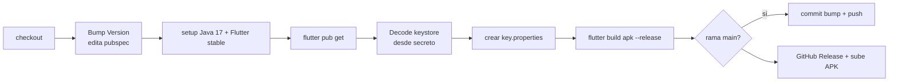

# CI/CD y Releases
{: .no_toc }

1. TOC
{:toc}

El workflow `.github/workflows/release.yml` ("Build and Release") compila y publica
el APK en cada push a `main`, `dev` o `unstable` (o manual vía
`workflow_dispatch`).

## Versionado por rama

El job calcula la nueva versión a partir de `version:` en `pubspec.yaml`:

| Rama | Nueva versión | Tag | ¿Prerelease? | ¿Commit de bump? |
|------|---------------|-----|:---:|:---:|
| `main` | `X.Y.(Z+1)+run` | `vX.Y.Z` | No | Sí (`[skip ci]`) |
| `unstable` | `X.Y.Z-unstable.run+run` | `vX.Y.Z-unstable.run` | Sí | No |
| `dev` | `X.Y.Z-nightly.run+run` | `vX.Y.Z-nightly.run` | Sí | No |

`run` = `github.run_number`. Los commits con `[skip ci]` se ignoran (evita bucles
de build tras el bump).

## Pasos

## Firma

La firma de release lee `android/key.properties`, generado en CI desde *secrets*:

| Secret | Uso |
|--------|-----|
| `KEYSTORE_BASE64` | Se decodifica a `android/app/upload-keystore.jks` |
| `KEYSTORE_PASSWORD` | `storePassword` |
| `KEY_ALIAS` | `keyAlias` |
| `KEY_PASSWORD` | `keyPassword` |

Sin `key.properties`, el build cae a firma **debug** (ver
`android/app/build.gradle.kts`).

> Mantén los *secrets* en GitHub → Settings → Secrets and variables → Actions.
> Si rotas el keystore, actualiza `KEYSTORE_BASE64` y las contraseñas.
{: .warning }

## Artefacto

- Salida: `build/app/outputs/flutter-apk/app-release.apk`.
- Se sube a una **GitHub Release** con `softprops/action-gh-release@v2`, marcada
  como prerelease en `unstable`/`dev`.
- En `main`, primero se hace commit del bump de versión y la release apunta a ese
  commit.
