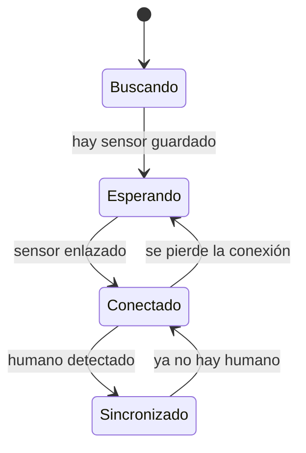

# Conexión BLE
{: .no_toc }

1. TOC
{:toc}

## Enlazar el sensor

1. Enciende el sensor **M5** y mantenlo cerca del teléfono.
2. Abre Therapets y ve a **Ajustes**.
3. En la sección de dispositivo, pulsa **Scan for devices**.
4. Selecciona tu sensor en la lista de dispositivos encontrados.
5. La app se conecta y **recuerda** el dispositivo: en adelante se reconecta sola.

Una vez enlazado, la app inicia un **servicio en segundo plano** que mantiene la
conexión viva aunque cierres la app o apagues la pantalla.

## Variantes del sensor

La app detecta automáticamente el tipo de sensor por el **tamaño del paquete BLE**
(detección "pegajosa": se fija con el primer paquete y no cambia hasta desconectar):

| Variante | Paquete | Pantalla dedicada |
|----------|---------|-------------------|
| **MAX30100** (oxímetro) | 16 bytes | [Sensores → Oxímetro](sensores.html) |
| **GY906** (temperatura) | 14 bytes | [Sensores → Temperatura](sensores.html) |

## Estados de sincronización

El HUD muestra cuatro estados. Solo **Sincronizado** hace feliz a tu mascota:

| Estado | Significado |
|--------|-------------|
| **Sincronizado** | Sensor conectado **y** humano detectado. La felicidad sube. |
| **Conectado** | Sensor conectado, pero sin detectar a una persona. |
| **Esperando** | Desconectado, pero hay un sensor recordado (reintenta solo). |
| **Buscando** | Desconectado y sin sensor recordado. |

### ¿Cómo se "detecta a un humano"?

- **MAX30100:** detecta dedo/muñeca por la señal IR, calcula pulso y SpO₂
  estables durante ~0,5 s.
- **GY906:** detecta temperatura de piel del antebrazo en rango **29,7 °C – 41 °C**
  sostenida ~0,5 s.

Hay una **ventana de gracia** para que parpadeos breves de la lectura no rompan el
estado *Sincronizado* de inmediato.

## Solución de problemas

| Problema | Solución |
|----------|----------|
| No aparece el sensor al escanear | Verifica que esté encendido y que el Bluetooth del teléfono esté activo. Acércalo. |
| Se conecta pero no sincroniza | Asegúrate de llevar el sensor en contacto con la piel (muñeca/antebrazo). |
| Se desconecta con la pantalla apagada | Concede la exención de optimización de batería ([Instalación](instalacion.html)). |
| Se desconecta al reiniciar el teléfono | La app reanuda el servicio al arrancar; ábrela una vez tras el reinicio si no reconecta. |

> Detalle técnico del protocolo y el procesamiento de señal en
> [Capa BLE y Protocolo](ble_protocolo.html).
{: .note }
