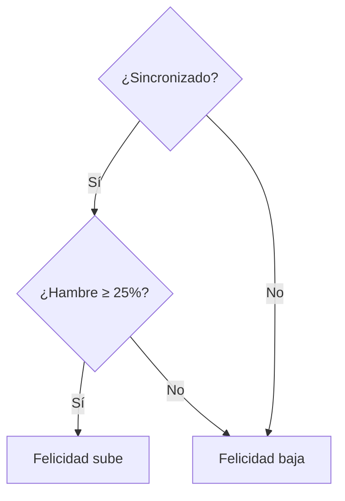

# Cuidado de la Mascota
{: .no_toc }

1. TOC
{:toc}

Tu mascota es **Bob**. Tiene dos estadísticas principales (de 0 % a 100 %) que
cambian con el tiempo: **hambre** y **felicidad**. Su promedio es el **bienestar**.

*El HUD (arriba a la izquierda) muestra el estado de sync, los corazones (felicidad), los muslos de pollo (hambre) y las monedas de plata y oro.*

## Hambre

- **Baja siempre** con el tiempo, estés sincronizado o no.
- Tarda aproximadamente **6 horas** en vaciarse desde el 100 %.
- Se restaura **alimentando** a Bob (ver [Comida y Tienda](comida_tienda.html)).

## Felicidad

- **Sube** mientras estás **Sincronizado** (sensor conectado + humano detectado)...
  tarda unas **2 horas** en llenarse desde 0 %.
- **Baja** cuando **no** estás sincronizado — unas **6 horas** en vaciarse.
- **Excepción:** si el hambre está por debajo del **25 %**, la felicidad **baja
  aunque estés sincronizado**. Mantén a Bob alimentado.

### Acumulador en segundo plano

Mientras la app está cerrada pero el sensor sigue sincronizado, la felicidad se
acumula en un **buffer**. Al volver a abrir la app, ese buffer se aplica de golpe,
así que tu esfuerzo en segundo plano no se pierde.

## Bienestar y notificaciones

- **Bienestar = promedio de hambre y felicidad.**
- Si el bienestar cae a **25 % o menos**, recibes una **notificación** de aviso.
- La notificación se rearma sola cuando Bob se recupera por encima del umbral.

## Monedas

| Moneda | Para qué | Cómo se gana |
|--------|----------|--------------|
| **Oro** 🪙 | Comprar **ropa** | Completar [misiones diarias](misiones_diarias.html). |
| **Plata** 🥈 | Comprar **comida** | Jugar [minijuegos](minijuegos.html). |

## Resumen de tasas

| Estadística | Comportamiento | Tiempo aprox. |
|-------------|----------------|---------------|
| Hambre | Baja siempre | ~6 h a vaciarse |
| Felicidad (sincronizado) | Sube | ~2 h a llenarse |
| Felicidad (no sincronizado) | Baja | ~6 h a vaciarse |
| Umbral de bienestar bajo | Notificación | ≤ 25 % |

> Las tasas son configurables en **Ajustes → Dev Tools** (ver [Ajustes](ajustes.html)).
{: .note }
