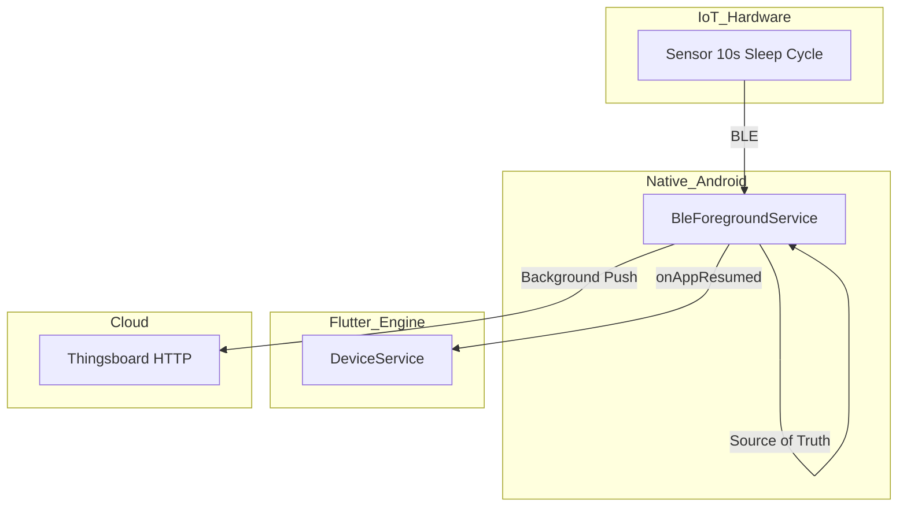

# Architecture & Sync (Sync State Vision)

This section documents the April 2026 audit on the "Sync State".

The "Sync State" dictates cloud telemetry, UI display, and daily missions. It acts as a bridge between hardware limitations (IoT 10s sensor sleep cycles) and mobile OS constraints.

## Sync Use Cases

1. **Bad Readings / Sleep Cycle (10s)**
   - *Trigger:* BLE connected, `humanDetected` flips to false.
   - *Action:* 15s grace window. The *last recorded state* is pushed to the history.
   - *Outcome:* Bridges the hardware sleep cycle without dropping the connection.
2. **Device Resting (No Human)**
   - *Trigger:* Grace window expires.
   - *Action:* `false` is pushed to history. Mission minute tally and cloud logs pause.
3. **Device Disconnection (BLE Drop)**
   - *Trigger:* Connection lost.
   - *Action:* UI freezes up to 30s ("waiting"). If reconnected, UI resumes. If not, UI history is wiped.
   - *Note:* Cloud history does NOT freeze; it logs as `false` (0s synced) without faking data.

## Architectural Mandate

- **Native Foreground Service:** The native Android foreground service (`BleForegroundService`) is the source of truth.
- **Flutter Lifecycle:** The Flutter method `DeviceService.onAppResumed()` must NEVER wipe the state; it must read the canonical state from Native.
- **Cloud:** Pushes (Thingsboard HTTP) and mission tallies run on Native to survive the Flutter engine suspension.

