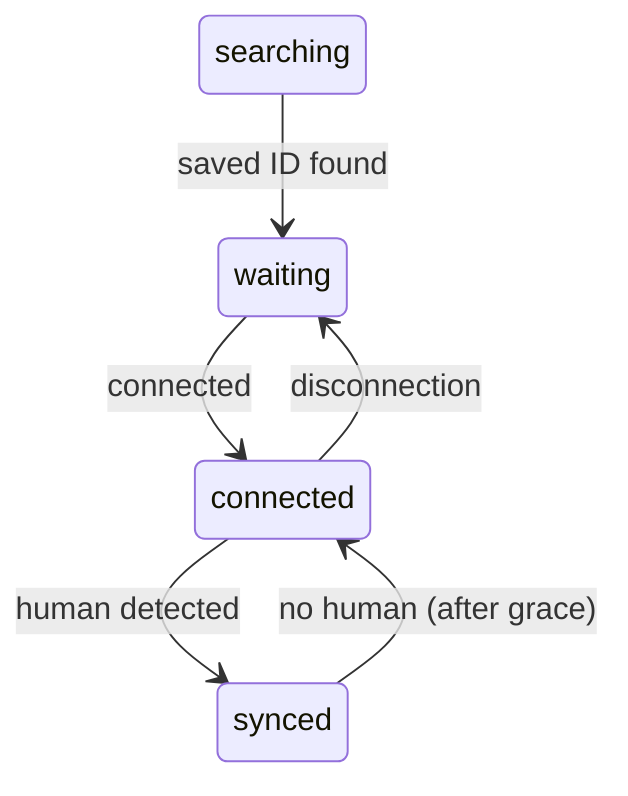

# Architecture
{: .no_toc }

1. TOC
{:toc}

Therapets is a **Flutter** app with an **Android (Kotlin)** native layer for
background work. The flow is: **Bluetooth → device abstraction →
game logic → UI**, with a cross-cutting **persistence and cloud** layer.

## Layers

```mermaid
graph TD
    subgraph Android Native (Kotlin)
      BFS[BleForegroundService] --> MM[MissionManager]
      BFS --> CM[CloudManager]
      BR[BootReceiver] --> BFS
    end
    subgraph Dart Services
      BT[BluetoothService] -->|incomingRaw$| DS[DeviceService]
      DS -->|telemetry$ / events$| GAME
      CS[CloudService]
      NS[PetNotificationService]
    end
    subgraph Flame Game
      GAME[VirtualPetGame] --> PET[Pet / PetStats]
      GAME --> MINI[Minigames]
    end
    UI[Screens / HUD] --> GAME
    BFS -. MethodChannel .- BT
    DS --> CS
    MS[MissionService] --> CS
```

| Layer | Key components | Location |
|-------|---------------|----------|
| Entry | `main.dart`, `BootstrapWrapper`, `TherapetsApp` | `lib/main.dart` |
| Bootstrap | `AppBootstrapper`, `AppLifecycleManager` | `lib/core/` |
| Device (BLE) | `BluetoothService`, `DeviceService`, signal processors | `lib/services/device/` |
| Cloud | `CloudService`, `CloudEvent`, `EventQueue` | `lib/services/cloud/` |
| Game | `VirtualPetGame`, `Pet`, `PetStats`, minigames | `lib/game/` |
| UI | `GameScreen`, HUD, menus, settings | `lib/screens/` |
| Native | `BleForegroundService`, `MissionManager`, `CloudManager`, `BootReceiver`, `MainActivity` | `android/app/src/main/kotlin/com/strawberryFrappe/sync_companion/` |

## Dependency injection

**`provider`** is used. Services are built and initialized in
`AppBootstrapper` (`lib/core/app_bootstrapper.dart`) and injected into the widget tree:
`CloudService`, `DeviceService`, `MissionService`, `PetStats`,
`PetNotificationService`, and `LocaleService` (the latter as a `ChangeNotifierProvider`).

## Lifecycle

`AppLifecycleManager` (`lib/core/app_lifecycle_manager.dart`) hooks into the
Flutter lifecycle:

- **pause/resume:** saves stats; on resume, `DeviceService.onAppResumed()`
  re-hooks the native `EventChannel` and requests the canonical state from the service.
- **Background rehydration:** `PetStats.applyBackgroundUpdates()` and
  `MissionService.rehydrateBackgroundProgress()` recalculate the time elapsed
  while the app was closed, using the clock and the last saved timestamp.

## Sync status (display status)

`DeviceService` (`lib/services/device/device_service.dart`) exposes `displayStatus$`
with four states (`synced`, `connected`, `waiting`, `searching`). The logic lives
in `DeviceStatusAggregator` (`device_status_aggregator.dart`), which combines:

- native connection state (survives UI restarts),
- **liveness**: recent telemetry (< 3 s),
- human detection (according to the sensor-type processor),
- a **grace window** to avoid breaking *synced* on brief dropouts,
- whether a minigame is in progress.

```mermaid
stateDiagram-v2
    searching --> waiting: saved ID found
    waiting --> connected: connected
    connected --> synced: human detected
    synced --> connected: no human (after grace)
    connected --> waiting: disconnection
```

## Sensor type detection

It is **sticky**: the first packet fixes the type and it does not change until
disconnect (`DeviceService.init()`):

- 16 bytes → `DeviceType.max30100`
- 14 bytes → `DeviceType.gy906`

See [BLE Layer & Protocol](ble_protocol.html) for the packet format.
