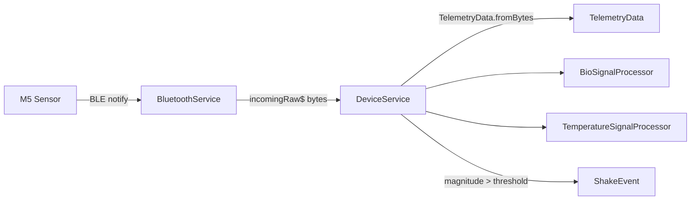

# BLE Layer & Protocol
{: .no_toc }

1. TOC
{:toc}

## Pipeline

- `BluetoothService` (`lib/services/device/bluetooth_service.dart`): scanning,
  connection, reconnection, and bridge to the native service (MethodChannel /
  EventChannel). Emits raw bytes on `incomingRaw$`.
- `DeviceService` (`device_service.dart`): parses bytes into `TelemetryData`, fixes the
  sensor type, routes to the correct processor, and emits `telemetry$` / `events$`.

## Packet format

All integers are **int16 little-endian** except vital fields (uint16). Logic in
`TelemetryData.fromBytes()` (`lib/game/models/telemetry_data.dart`). Valid sizes:
**12, 14, or 16 bytes**.

| Offset | Field | Type | Scale | Unit |
|:------:|-------|------|-------|------|
| 0 | aX | int16 LE | `/ 1000` | g |
| 2 | aY | int16 LE | `/ 1000` | g |
| 4 | aZ | int16 LE | `/ 1000` | g |
| 6 | gX | int16 LE | `/ 10` | °/s |
| 8 | gY | int16 LE | `/ 10` | °/s |
| 10 | gZ | int16 LE | `/ 10` | °/s |

Extension by size:

| Size | Variant | Extra fields |
|:----:|---------|-------------|
| **12** | — (IMU only) | none |
| **14** | GY906 | `rawTemp` = **uint16 LE** @12 |
| **16** | MAX30100 | `rawIr` = uint16 LE @12, `rawRed` = uint16 LE @14 |

**Temperature (GY906):** `°C = rawTemp * 0.02 - 273.15` (datasheet formula).
`rawTemp == 0` ⇒ sensor disconnected/error.

## Sensor type detection (sticky)

On the first packet with valid data (`DeviceService.init`):

- 16 bytes ⇒ `max30100`
- 14 bytes ⇒ `gy906`

The type stays fixed until disconnect, at which point it resets to `unknown`
and the processors are restarted.

## Anti-corruption filters

IoT hardware generates noise/spikes. Filters applied:

| Filter | Where | Rule |
|--------|-------|------|
| IMU magnitude | `TelemetryData.fromBytes` | rejects packet if `|accel| > 10.0 g` |
| IR spike | `BioSignalProcessor.process` | discards if `|ΔrawIr| > 20000` (up to 50 in a row) |
| IR sensor error | `BioSignalProcessor` | `rawIr/rawRed == 65535 (0xFFFF)` ⇒ disconnected |
| Temperature error | `TemperatureSignalProcessor` | `rawTemp == 0` ⇒ disconnected |

## Gesture detection

`DeviceService._checkForHighLevelEvents`: if `magnitude > _shakeThreshold`
(default **2.5**, adjustable) it emits a `ShakeEvent`. Consumed by *Flappy Bob*.
Continuous telemetry (tilt) is consumed by *Orchestra*.

## Bio-signal processing (MAX30100)

`BioSignalProcessor` (`bio_signal_processor.dart`) replicates the Arduino-MAX30100
reference library:

- **Filters:** `DCRemover` (α=0.95) + 1st-order Butterworth low-pass
  (Fs=100 Hz, Fc=6 Hz).
- **Beat detection:** state machine (`init → waiting → followingSlope →
  maybeDetected → masking`) with adaptive threshold.
- **BPM:** `60000 / beatPeriod`, clamped to **30–220**.
- **SpO₂:** log ratio of RED/IR AC² sums against a **LUT** (TI reference),
  every 4 beats. Physiological range **70–100%**.
- **Finger detection:** hysteresis (ON if IR > 5000, OFF if IR < 3000).
- **Human detected:** finger + valid BPM (40–200) + SpO₂ ≥ 85% + sustained presence
  (~0.5 s) + stable BPM.
- **Pre-seed:** the native service can preload BPM/SpO₂ to skip the warm-up.

## Temperature processing (GY906)

`TemperatureSignalProcessor` (`temperature_signal_processor.dart`):

- Converts raw→°C, maintains a waveform buffer (~5 s @100 Hz) and history.
- **Human detected:** °C in **29.7–41** sustained for **50 samples** (0.5 s).
- Saves the **last valid reading** with timestamp (fresh for up to 60 s).

## Tests

`test/telemetry_decoder_test.dart`, `test/device_status_aggregator_test.dart`,
`test/last_reading_retention_test.dart` cover packet decoding (12/14/16 B),
corruption heuristics, and status aggregation.
