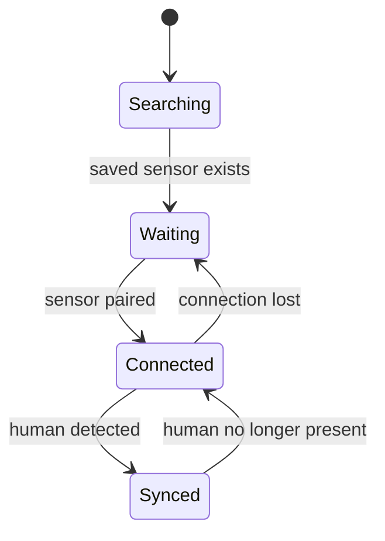

# BLE Connection
{: .no_toc }

1. TOC
{:toc}

## Pairing the sensor

1. Power on the **M5** sensor and keep it near the phone.
2. Open Therapets and go to **Settings**.
3. In the device section, tap **Scan**.
4. Pick your sensor from the list of found devices.
5. The app connects and **remembers** the device: from then on it reconnects automatically.

Once paired, the app starts a **background service** that keeps the connection
alive even if you close the app or turn off the screen.

## Sensor variants

The app auto-detects the sensor type by the **BLE packet size** (sticky detection:
fixed by the first packet, unchanged until disconnect):

| Variant | Packet | Dedicated screen |
|---------|--------|------------------|
| **MAX30100** (oximeter) | 16 bytes | [Sensors → Oximeter](sensor_screens.html) |
| **GY906** (temperature) | 14 bytes | [Sensors → Temperature](sensor_screens.html) |

## Sync states

The HUD shows four states. Only **Synced** makes your pet happy:

| State | Meaning |
|-------|---------|
| **Synced** | Sensor connected **and** human detected. Happiness rises. |
| **Connected** | Sensor connected, but no person detected. |
| **Waiting** | Disconnected, but a sensor is remembered (auto-retries). |
| **Searching** | Disconnected and no sensor remembered. |

### How is a "human detected"?

- **MAX30100:** detects finger/wrist via the IR signal, computing stable BPM and
  SpO₂ for ~0.5 s.
- **GY906:** detects forearm skin temperature in the **29.7 °C – 41 °C** range
  sustained for ~0.5 s.

There is a **grace window** so brief reading dropouts don't immediately break the
*Synced* state.

## Troubleshooting

| Problem | Fix |
|---------|-----|
| Sensor doesn't appear when scanning | Check it's on and the phone's Bluetooth is enabled. Move it closer. |
| Connects but won't sync | Make sure the sensor is in contact with skin (wrist/forearm). |
| Disconnects with the screen off | Grant the battery-optimization exemption ([Installation](installation.html)). |
| Disconnects after reboot | The app resumes the service on boot; open it once after rebooting if it doesn't reconnect. |

> Protocol and signal-processing details in [BLE Layer & Protocol](ble_protocol.html).
{: .note }
