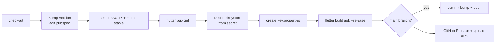

# CI/CD & Releases
{: .no_toc }

1. TOC
{:toc}

The workflow `.github/workflows/release.yml` ("Build and Release") compiles and
publishes the APK on every push to `main`, `dev`, or `unstable` (or manually via
`workflow_dispatch`).

## Branch-based versioning

The job calculates the new version from `version:` in `pubspec.yaml`:

| Branch | New version | Tag | Prerelease? | Bump commit? |
|--------|-------------|-----|:-----------:|:-----------:|
| `main` | `X.Y.(Z+1)+run` | `vX.Y.Z` | No | Yes (`[skip ci]`) |
| `unstable` | `X.Y.Z-unstable.run+run` | `vX.Y.Z-unstable.run` | Yes | No |
| `dev` | `X.Y.Z-nightly.run+run` | `vX.Y.Z-nightly.run` | Yes | No |

`run` = `github.run_number`. Commits with `[skip ci]` are ignored (prevents
build loops after the bump).

## Steps

## Signing

The release signing reads `android/key.properties`, generated in CI from *secrets*:

| Secret | Use |
|--------|-----|
| `KEYSTORE_BASE64` | Decoded to `android/app/upload-keystore.jks` |
| `KEYSTORE_PASSWORD` | `storePassword` |
| `KEY_ALIAS` | `keyAlias` |
| `KEY_PASSWORD` | `keyPassword` |

Without `key.properties`, the build falls back to **debug** signing (see
`android/app/build.gradle.kts`).

> Keep secrets in GitHub → Settings → Secrets and variables → Actions.
> If you rotate the keystore, update `KEYSTORE_BASE64` and the passwords.
{: .warning }

## Artifact

- Output: `build/app/outputs/flutter-apk/app-release.apk`.
- Uploaded to a **GitHub Release** with `softprops/action-gh-release@v2`, marked
  as a prerelease on `unstable`/`dev`.
- On `main`, the version bump commit is made first and the release points to that
  commit.
