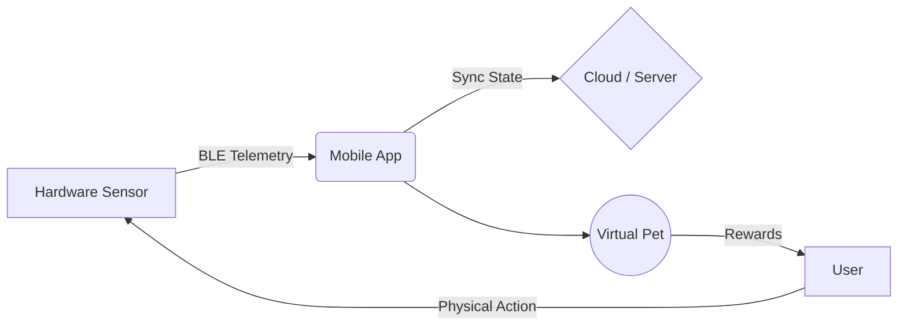

# Welcome to Therapets

**Therapets** is your smart companion designed to foster the building of healthy habits through gamified interaction with virtual pets. More than just an app, it's a bridge between the physical world (via a smart sensor) and the digital world.

## Our Vision

This manual is designed for both **end users** and **future developers**. Our vision is for the system to be transparent, resilient, and friendly. 
For the user, the experience must be seamless: your daily effort directly reflects on your pet's well-being. For the developer, the architecture behind this must guarantee no data loss, overcoming the limitations of IoT hardware and mobile operating systems.

## Getting Started

If you are a **new user**:
1. Start with the **[BLE Setup](/en/ble_setup.html)** to link your device.
2. Discover how the **[Daily Missions](/en/daily_missions.html)** work.
3. Learn about **[Pet Care & Feeding](/en/pet_care.html)**.

If you are a **developer**:
- Head straight to the **[Telemetry Config](/en/telemetry.html)** section and our **[Architecture & Sync State](/en/architecture.html)** docs.
