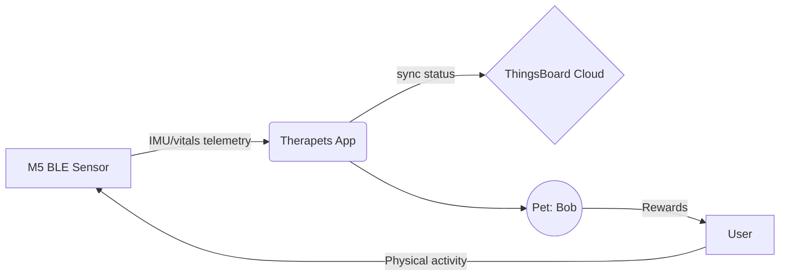

# Therapets
{: .no_toc }

**Therapets** is a virtual companion (Tamagotchi-style) that comes to life with an
**M5 BLE sensor** you carry with you. Your real physical activity keeps your pet
happy: the movement and presence detected by the sensor translate into
wellbeing, coins, and in-game progress.
{: .fs-6 .fw-300 }

[Get Started: BLE Connection](ble_setup.html){: .btn .btn-purple .mr-2 }
[Technical Documentation](developer.html){: .btn }

*Main screen: Bob, the status HUD (top-left), and shortcuts to games, wardrobe, fridge, and store.*

---

## What is Therapets?

It is a bridge between the physical and digital worlds:

```mermaid
graph LR
    A[M5 BLE Sensor] -->|IMU/vitals telemetry| B(Therapets App)
    B -->|sync status| C{ThingsBoard Cloud}
    B --> D((Pet: Bob))
    D -->|Rewards| E[User]
    E -->|Physical activity| A
```

- **For end users:** take care of *Bob*, play motion-controlled minigames, complete
  daily missions, and buy food and clothing.
- **For the development team:** a Flutter app with a robust BLE layer, native
  background service, cloud synchronization, and persistence resilient to system
  kills.

## Companion hardware

The **M5-IMU** sensor comes in two variants; the app detects which one is connected
by the BLE packet size:

| Variant | Sensor | Packet | Measures |
|---------|--------|--------|---------|
| **MAX30100** | Pulse oximeter | 16 bytes | Pulse (BPM), SpO₂, IMU |
| **GY906** | IR thermometer | 14 bytes | Body temperature, IMU |

> Both variants include a 6-axis IMU (accelerometer + gyroscope).
{: .note }

## Where to start?

**If you are a new user:**
1. [Installation](installation.html) — download and install the app.
2. [BLE Connection](ble_setup.html) — pair your sensor.
3. [Pet Care](pet_care.html) — understand hunger and happiness.

**If you are a developer:**
- Read [Architecture](architecture.html), then [BLE Layer & Protocol](ble_protocol.html)
  and [Development Environment](dev_environment.html).

## Quick glossary

| Term | Meaning |
|------|---------|
| **Bob** | The pet (variant `BobTheBlob`, ball-type body). |
| **Sync / Synced** | Sensor connected **and** human detected. |
| **Telemetry** | Sensor readings (IMU + vitals) sent over BLE. |
| **Gold** | Currency for clothing (earned through missions). |
| **Silver** | Currency for food (earned through minigames). |
| **Mission** | Daily objective that grants gold and happiness. |
