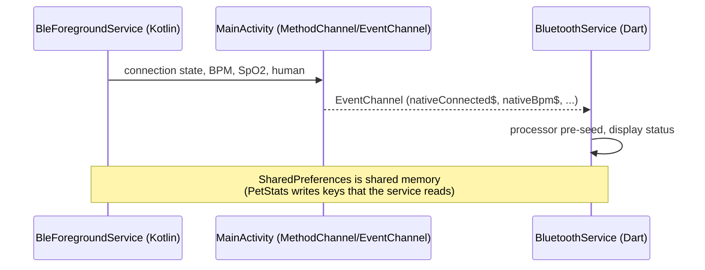

# Android Native Layer (Kotlin)
{: .no_toc }

1. TOC
{:toc}

Flutter is suspended when the app goes to the background, but BLE must stay
alive. For this reason, the connection and critical logic live in a **native
Kotlin service**. Files located at
`android/app/src/main/kotlin/com/strawberryFrappe/sync_companion/`.

## Components

| File | Role |
|------|------|
| `MainActivity.kt` | Flutter entry point; exposes `MethodChannel`/`EventChannel` to communicate with Dart. |
| `BleForegroundService.kt` | *Foreground* service that keeps the BLE connection alive and processes telemetry even when the UI is dead. |
| `MissionManager.kt` | Evaluates mission progress natively (survives Flutter suspension). |
| `CloudManager.kt` | Queues and aggregates telemetry per minute on the native side. |
| `BootReceiver.kt` | Receives `BOOT_COMPLETED` and resumes the service when the phone boots. |

## Why native

- Android kills Flutter isolates in the background; a **foreground service**
  with a persistent notification is not killed.
- Per-minute telemetry aggregation and mission evaluation were moved to native
  to avoid losing data during long suspensions.

## Foreground service

Declared in `AndroidManifest.xml`:

```xml
<service android:name=".BleForegroundService"
         android:foregroundServiceType="dataSync"
         android:stopWithTask="false" />
```

- `stopWithTask="false"`: keeps running even if the user swipes the app away
  from recents.
- Service types: `dataSync` (native) and `connectedDevice` (`flutter_foreground_task`
  plugin).
- **Grace window (~15 s):** momentary bad readings do not drop the connection.
- **Corruption filters** equivalent to the Dart-side ones (magnitude, IR delta) to
  avoid contaminating aggregation.

## Dart ↔ Native bridge



- `DeviceService` listens to `nativeConnected$`, `nativeBpm$`, `nativeSpo2$`,
  `nativeHumanDetected$` and **prioritizes native state** because it survives
  UI restarts.
- On returning from the background, `DeviceService.onAppResumed()` re-hooks the
  `EventChannel` and requests the canonical state.

## Shared memory via SharedPreferences

`PetStats._mirrorToPrefs()` writes individual keys
(`pet_hunger`, `pet_happiness`, `pet_last_update`, rates, threshold) **in addition to**
the JSON bundle, specifically so that the native Kotlin service can read and
update the pet state without Flutter running. See [Data Model](data_model.html).
