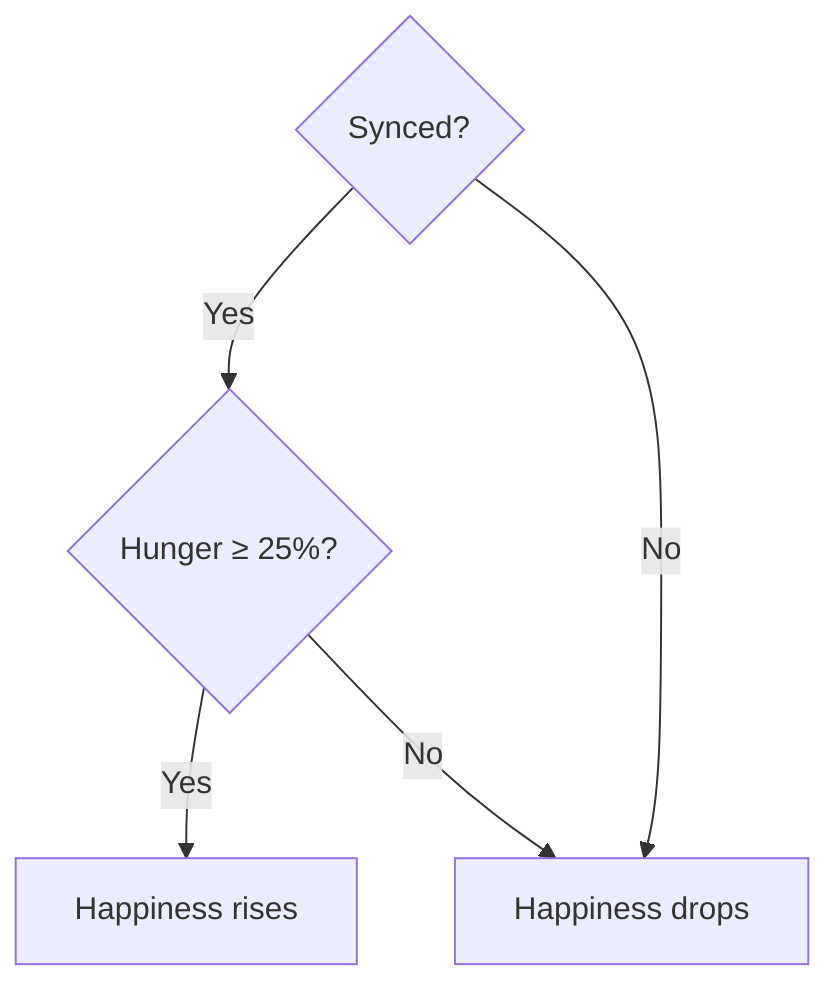

# Pet Care
{: .no_toc }

1. TOC
{:toc}

Your pet is **Bob**. He has two main stats (from 0% to 100%) that change over
time: **hunger** and **happiness**. Their average is **wellbeing**.

*The HUD (top-left) shows the sync state, hearts (happiness), drumsticks (hunger), and the silver and gold coins.*

## Hunger

- **Always drops** over time, whether you are synced or not.
- Takes approximately **6 hours** to drain from 100%.
- Restored by **feeding** Bob (see [Food & Store](food_store.html)).

## Happiness

- **Rises** while you are **Synced** (sensor connected + human detected) —
  takes about **2 hours** to fill from 0%.
- **Drops** when you are **not** synced — about **6 hours** to drain.
- **Exception:** if hunger is below **25%**, happiness **drops even when you are
  synced**. Keep Bob fed.

### Background accumulator

While the app is closed but the sensor remains synced, happiness accumulates in a
**buffer**. When you reopen the app, that buffer is applied all at once, so your
background effort is never lost.

## Wellbeing and notifications

- **Wellbeing = average of hunger and happiness.**
- If wellbeing drops to **25% or below**, you receive a **warning notification**.
- The notification resets itself once Bob recovers above the threshold.

## Coins

| Coin | Used for | How to earn |
|------|----------|-------------|
| **Gold** 🪙 | Buying **clothing** | Complete [daily missions](daily_missions.html). |
| **Silver** 🥈 | Buying **food** | Play [minigames](minigames.html). |

## Rate summary

| Stat | Behavior | Approx. time |
|------|----------|-------------|
| Hunger | Always drops | ~6 h to drain |
| Happiness (synced) | Rises | ~2 h to fill |
| Happiness (not synced) | Drops | ~6 h to drain |
| Low wellbeing threshold | Notification | ≤ 25% |

> Rates are configurable in **Settings → Dev Tools** (see [Settings](settings.html)).
{: .note }
