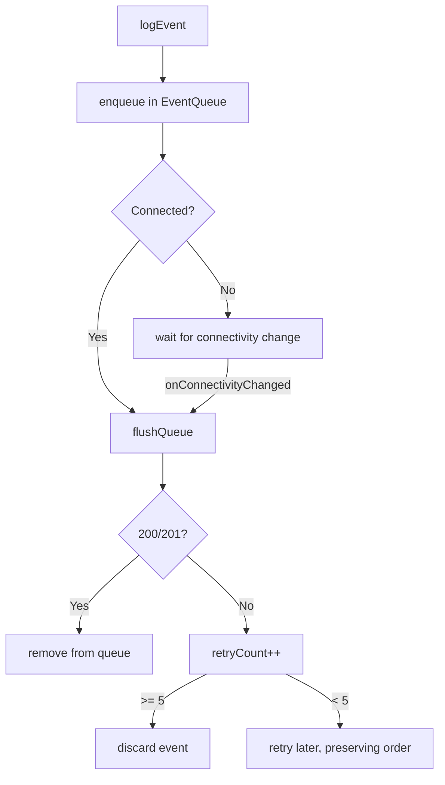

# Telemetry & Cloud
{: .no_toc }

1. TOC
{:toc}

The app sends events to a **ThingsBoard** server via its HTTP telemetry API.
Implemented in `lib/services/cloud/`.

## Configuration

| Key (SharedPreferences) | Default value |
|-------------------------|--------------|
| `cloud_base_url` | `http://200.13.5.20:8080` |
| `cloud_device_token` | *(empty)* |


*The "Cloud Sync" section in Advanced settings: base URL, device token, pending events, and Configure / Flush Queue buttons.*

Configured in **Settings → Advanced configuration** (the URL and token; the token
can be scanned by QR). Without a token the cloud is **unconfigured** and events
are silently discarded.

## Endpoint

```
POST {baseUrl}/api/v1/{deviceToken}/telemetry
Content-Type: application/json
```

Body (unified, custom envelope — **not** ThingsBoard's `ts`/`values` shape;
since 2026-07-02 both the native and Dart clients produce this same JSON):

```json
{
  "eventType": "sync_status",
  "timestamp": 1714000000000,
  "payload": { "synced": true, "vitals": { "avgBpm": 72, "avgSpo2": 98 } }
}
```

- `payload` is a real JSON object, not a re-serialized string.
- `vitals` is omitted entirely when there are no readings (Dart used to always
  send `vitals: {}`).

> **Each `eventType` is its own separate event and POST.** `sync_status` and
> `mission_completed` (and `minigame_played`) are never combined into one
> send — they only share this same envelope shape (`eventType`/`timestamp`/
> `payload`). Before 2026-07-02, native sent a flat `{eventType: payload}`
> envelope and Dart sent a ThingsBoard-shaped one (`ts`/`values`/a doubly-
> encoded string) — only the envelope *shape* was unified, not the events.
{: .note }

## Event types

| Event | When | Main payload |
|-------|------|-------------|
| `sync_status` | Per minute (native layer, sole source of truth) | `synced` + `vitals` (`avgBpm`/`avgSpo2` or `avgTemp`) |
| `mission_completed` | Mission completed | `mission_id` |
| `minigame_played` | Round played | `game_id`, `score`, `play_time_seconds` |

> The `sync_session` event (a redundant Dart-side usage tracker that depended
> on the Flutter engine and suffered the same missing-wakelock bug) was
> removed on 2026-07-02 — native `sync_status` is now the sole usage-truth.
> Per-minute aggregation is done in the [native layer](native_layer.html).
{: .note }

## Treatment endpoint (read, separate host)

Besides telemetry (above, always *push*), the app makes **one** read from the
server: the patient's active treatment/prescription.

```
GET http://200.13.5.19:3000/patients/treatment/by-device-token/{deviceToken}
```

Implemented in `lib/services/treatment/treatment_service.dart`. Uses the same
`deviceToken` value as telemetry, but against a **different host** (`.19`, not
`.20`). Read-only — no write-back endpoint exists or is assumed for reporting
progress. See `docs/adr/0011-game-allowlist-treatment-integration.md` for the
full design (fail-open/closed policy, minigame name mapping, etc.).

## Offline queue and retries

`EventQueue` (`event_queue.dart`) persists events in **SharedPreferences**
(not Hive — Hive was removed from the project, see ADR-0002) until they can be sent:



- `CloudService` listens to `connectivity_plus` and **flushes** automatically
  when the network is restored.
- The flush **stops at the first failure** to preserve order.
- An event is **discarded after 5 failed attempts**.
- Timeout per POST: **10 s**.
