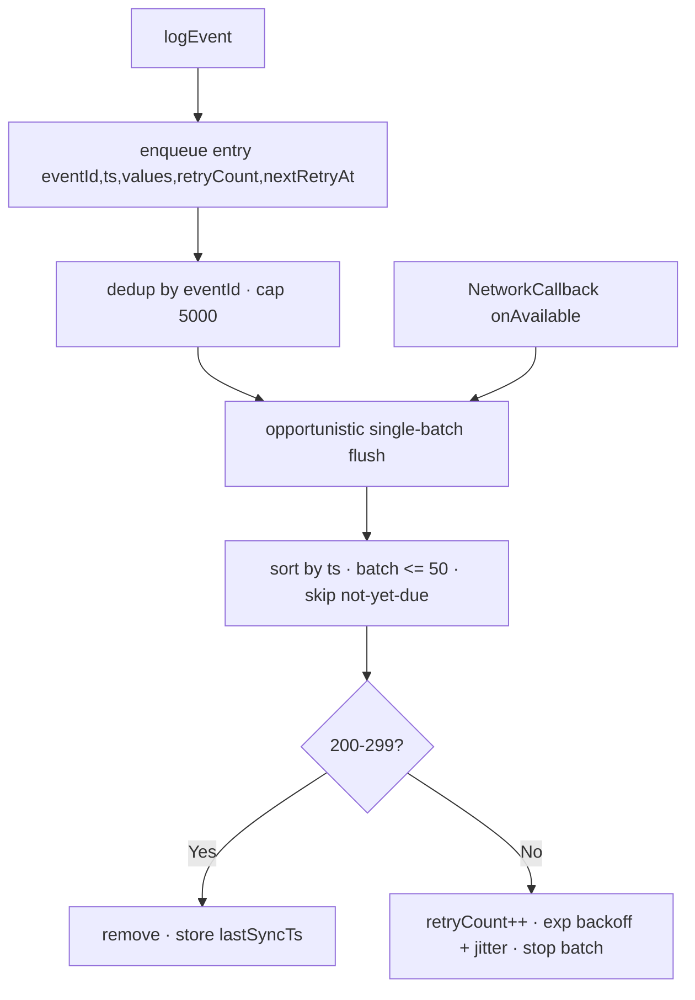

# Telemetry & Cloud
{: .no_toc }

1. TOC
{:toc}

The app sends events to a **ThingsBoard** server via its HTTP telemetry API.
Implemented in `lib/services/cloud/`.

## Configuration

| Key (SharedPreferences) | Default value |
|-------------------------|--------------|
| `cloud_base_url` | `http://200.13.5.20:8080` |
| `cloud_device_token` | *(empty)* |


*The "Cloud Sync" section in Advanced settings: base URL, device token, pending events, and Configure / Flush Queue buttons.*

Configured in **Settings → Advanced configuration** (the URL and token; the token
can be scanned by QR). Without a token the cloud is **unconfigured** and events
are silently discarded.

> **Host validation (2026-07-13).** Saving an `http://` URL whose host is not in the
> allowlist (`200.13.5.20`) is **blocked** in the dialog, because
> `network_security_config.xml` only permits cleartext to that host and Android
> would silently drop the sends. `https://` is always accepted. Adding another HTTP
> host requires editing **both** the Dart allowlist and `network_security_config.xml`.
{: .note }

## Endpoint

```
POST {baseUrl}/api/v1/{deviceToken}/telemetry
Content-Type: application/json
```

Body (native ThingsBoard `ts`/`values` shape; since **2026-07-13** the single
canonical key is `payload`, with `eventType`/`eventId` living **inside** it):

```json
{
  "ts": 1714000000000,
  "values": {
    "payload": {
      "eventId": "sync_status-1714000000000",
      "eventType": "sync_status",
      "synced": true,
      "vitals": { "avgBpm": 72, "avgSpo2": 98, "avgTemp": 34.2 }
    }
  }
}
```

- `ts` is the **real start of the 60 s window** (epoch ms), kept intact across
  retries — ThingsBoard uses it as `entry.ts`, so an event generated offline lands
  on its true clinical day, not the reconnection day.
- `eventId` identifies the event stably across retries (`<eventType>-<ts>`); the
  backend deduplicates on it.
- `eventType`/`eventId` live **inside `payload`**, not as sibling series. ThingsBoard
  stores a single `payload` series and the backend does **not** need to correlate
  series by reception timestamp.
- `vitals` is omitted entirely when there are no readings.

> **Usage rule (backend):** only `eventType === "sync_status"` **and**
> `payload.synced === true` count as 60 s. `synced:false`, `mission_completed`,
> `minigame_played`, and legacy formats (`moving`/`telemetry`/`sync_session`) count 0.
{: .note }

> **Contract change (2026-07-13).** Each event used to be sent as its own
> `{eventType, timestamp, payload}` envelope, producing **three** ThingsBoard series
> (`eventType`/`timestamp`/`payload`) the backend had to re-correlate. Now there is a
> single `payload` series. **Requires deploying the `prosthetic-api` backend in
> lockstep** — an old backend doesn't understand the new envelope.
{: .warning }

## Event types

| Event | When | Main payload |
|-------|------|-------------|
| `sync_status` | Per minute (native layer, sole source of truth) | `synced` + `vitals` (`avgBpm`/`avgSpo2` and/or `avgTemp`) |
| `mission_completed` | Mission completed | `mission_id` |

> **Single publisher (2026-07-13).** `mission_completed` is emitted **only** by the
> native layer (`MissionManager.kt`), which survives Flutter suspension. The duplicate
> Dart publisher was removed (both sides could previously post the same mission).
> `minigame_played` and Dart's `logSyncStatus` were dead code and were deleted.
{: .note }

> **Clinical vs. visual presence (2026-07-13).** The synced-seconds tally
> (`syncedSecondsThisMinute`) now uses **instantaneous, no-grace presence**; the 15 s
> grace-smoothed presence still feeds UI, pet-care and visual mission progress. This
> enforces [ADR-0007](../adr/0007-truthful-telemetry-with-ux-grace.md): visual
> smoothing must not inflate the clinical record. Effect: synced minutes may read
> **slightly lower** than before.
{: .note }

> The `sync_session` event (a redundant Dart-side usage tracker that depended
> on the Flutter engine and suffered the same missing-wakelock bug) was
> removed on 2026-07-02 — native `sync_status` is now the sole usage-truth.
> Per-minute aggregation is done in the [native layer](native_layer.html).
{: .note }

## Treatment endpoint (read, separate host)

Besides telemetry (above, always *push*), the app makes **one** read from the
server: the patient's active treatment/prescription.

```
GET http://200.13.5.19:3000/patients/treatment/by-device-token/{deviceToken}
```

Implemented in `lib/services/treatment/treatment_service.dart`. Uses the same
`deviceToken` value as telemetry, but against a **different host** (`.19`, not
`.20`). Read-only — no write-back endpoint exists or is assumed for reporting
progress. See `docs/adr/0011-game-allowlist-treatment-integration.md` for the
full design (fail-open/closed policy, minigame name mapping, etc.).

## Offline queue and retries

The canonical queue lives in **`CloudManager.kt`** (native layer), persisted in
SharedPreferences (not Hive — see ADR-0002). Since native is the sole source of
`sync_status`/`mission_completed`, its queue is the one that matters; Dart's
`EventQueue` was left without publishers after the 2026-07-13 change.



- **Connectivity flush:** the service registers a `ConnectivityManager.NetworkCallback`;
  regaining the network drains the queue even without a new event.
- **Bounded batches:** up to 50 per flush, in `ts` order, respecting `nextRetryAt`.
- The flush **stops at the first failure** to preserve order.
- **Exponential backoff** (base 2, cap 5 min, ±20% jitter) per entry via `nextRetryAt`.
- **Idempotency:** stable `eventId` → re-enqueuing the same event replaces its copy
  while carrying over the backoff; the backend deduplicates on `eventId`.
- **Queue capped at 5000:** on overflow the oldest **non-`sync_status`** entry is
  dropped first; `sync_status` is only dropped as a last resort (and logged), since
  it feeds the usage rule.
- State surfaced to the UI via the `sync_companion/bluetooth` MethodChannel
  (`getCloudQueueCount`/`getLastCloudSync`/`getLastCloudError`/`flushCloudQueue`):
  the Cloud Sync section shows the real **native** queue, not the Dart one.
- Timeout per POST: **5 s**.
