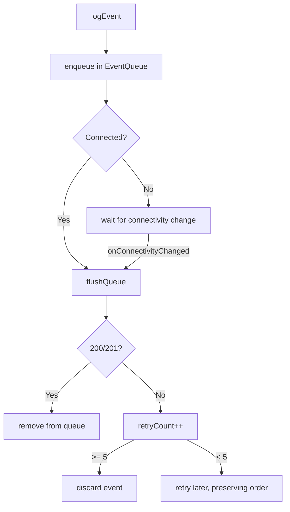

# Telemetry & Cloud
{: .no_toc }

1. TOC
{:toc}

The app sends events to a **ThingsBoard** server via its HTTP telemetry API.
Implemented in `lib/services/cloud/`.

## Configuration

| Key (SharedPreferences) | Default value |
|-------------------------|--------------|
| `cloud_base_url` | `http://200.13.5.20:8080` |
| `cloud_device_token` | *(empty)* |


*The "Cloud Sync" section in Advanced settings: base URL, device token, pending events, and Configure / Flush Queue buttons.*

Configured in **Settings → Advanced configuration** (the URL and token; the token
can be scanned by QR). Without a token the cloud is **unconfigured** and events
are silently discarded.

## Endpoint

```
POST {baseUrl}/api/v1/{deviceToken}/telemetry
Content-Type: application/json
```

Body (ThingsBoard format):

```json
{
  "ts": 1714000000000,
  "values": {
    "telemetry": "{\"event_type\":\"sync_status\", ...}"
  }
}
```

- The key is `"mission"` for `mission_completed` events, and `"telemetry"` for
  the rest.
- The event payload is serialized as a JSON string inside `values`.

## Event types

| Event | When | Main payload |
|-------|------|-------------|
| `sync_status` | Per minute | `synced` + `vitals` (`avgBpm`/`avgSpo2` or `avgTemp`) |
| `sync_session` | End of session | `duration_seconds`, `start_time` |
| `mission_completed` | Mission completed | `mission_id` |
| `minigame_played` | Round played | `game_id`, `score`, `play_time_seconds` |

> Vitals are wrapped in a `vitals` object for consistent server-side parsing.
> Per-minute aggregation is done in the [native layer](native_layer.html).
{: .note }

## Offline queue and retries

`EventQueue` (`event_queue.dart`) persists events (Hive) until they can be sent:



- `CloudService` listens to `connectivity_plus` and **flushes** automatically
  when the network is restored.
- The flush **stops at the first failure** to preserve order.
- An event is **discarded after 5 failed attempts**.
- Timeout per POST: **10 s**.
