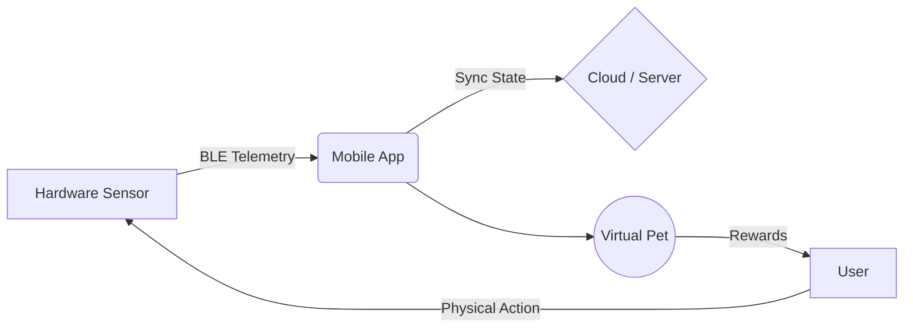

# Bienvenido a Therapets

**Therapets** es tu compañero inteligente diseñado para fomentar la construcción de hábitos saludables a través de una interacción gamificada con mascotas virtuales. Más que una simple aplicación, es un puente entre el mundo físico (a través de un sensor inteligente) y el mundo digital.

## Nuestra Visión

Este manual está diseñado tanto para **usuarios finales** como para **futuros desarrolladores**. Nuestra visión es que el sistema sea transparente, resiliente y amigable. 
Para el usuario, la experiencia debe ser fluida: su esfuerzo diario se refleja directamente en el bienestar de su mascota. Para el desarrollador, la arquitectura detrás de esto debe garantizar que no se pierdan datos, superando las limitaciones del hardware IoT y los sistemas operativos móviles.

## ¿Cómo Empezar?

Si eres un **usuario nuevo**:
1. Empieza con la **[Conexión BLE](/configuracion_ble.html)** para enlazar tu dispositivo.
2. Descubre cómo funcionan las **[Misiones Diarias](/misiones_diarias.html)**.
3. Aprende sobre el **[Cuidado de tu Mascota](/cuidado_mascota.html)**.

Si eres un **desarrollador**:
- Dirígete directamente a la sección de configuración de **[Telemetría](/telemetria.html)** y nuestra **[Arquitectura y Sincronización](/arquitectura.html)**.
