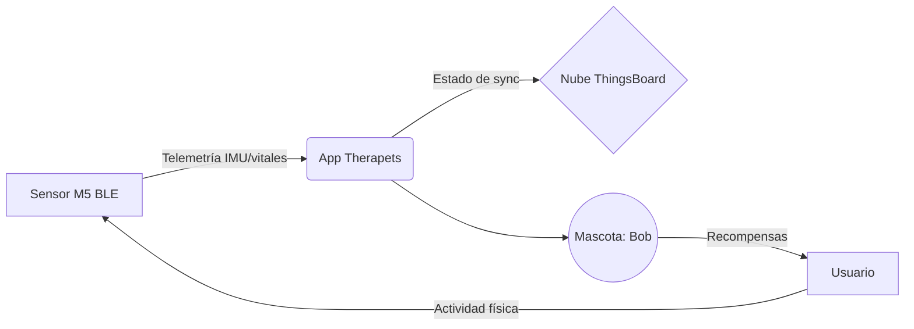

# Therapets
{: .no_toc }

**Therapets** es un compañero virtual (estilo Tamagotchi) que cobra vida con un
**sensor BLE M5** que llevas contigo. Tu actividad física real mantiene feliz a tu
mascota: el movimiento y la presencia detectada por el sensor se traducen en
bienestar, monedas y progreso dentro del juego.
{: .fs-6 .fw-300 }

[Empezar: Conexión BLE](configuracion_ble.html){: .btn .btn-purple .mr-2 }
[Documentación técnica](desarrollo.html){: .btn }

*Pantalla principal: Bob, el HUD de estado (arriba a la izquierda), y los accesos a juegos, guardarropa, refrigerador y tienda.*

---

## ¿Qué es Therapets?

Es un puente entre el mundo físico y el digital:

```mermaid
graph LR
    A[Sensor M5 BLE] -->|Telemetría IMU/vitales| B(App Therapets)
    B -->|Estado de sync| C{Nube ThingsBoard}
    B --> D((Mascota: Bob))
    D -->|Recompensas| E[Usuario]
    E -->|Actividad física| A
```

- **Para el usuario final:** cuida a *Bob*, juega minijuegos controlados por
  movimiento, cumple misiones diarias y compra comida y ropa.
- **Para el equipo de desarrollo:** una app Flutter con una capa BLE robusta,
  servicio nativo en segundo plano, sincronización a la nube y persistencia
  resistente a cierres del sistema.

## Hardware compañero

El sensor **M5-IMU** existe en dos variantes; la app detecta cuál está conectada
por el tamaño del paquete BLE:

| Variante | Sensor | Paquete | Mide |
|----------|--------|---------|------|
| **MAX30100** | Oxímetro de pulso | 16 bytes | Pulso (BPM), SpO₂, IMU |
| **GY906** | Termómetro IR | 14 bytes | Temperatura corporal, IMU |

> Ambas variantes incluyen un IMU de 6 ejes (acelerómetro + giroscopio).
{: .note }

## ¿Por dónde empezar?

**Si eres usuario nuevo:**
1. [Instalación](instalacion.html) — descarga e instala la app.
2. [Conexión BLE](configuracion_ble.html) — enlaza tu sensor.
3. [Cuidado de la mascota](cuidado_mascota.html) — entiende hambre y felicidad.

**Si eres desarrollador:**
- Lee [Arquitectura](arquitectura.html), luego [Capa BLE y Protocolo](ble_protocolo.html)
  y [Entorno de desarrollo](entorno.html).

## Glosario rápido

| Término | Significado |
|---------|-------------|
| **Bob** | La mascota (variante `BobTheBlob`, cuerpo tipo "ball"). |
| **Sync / Sincronizado** | Sensor conectado **y** humano detectado. |
| **Telemetría** | Lecturas del sensor (IMU + vitales) enviadas por BLE. |
| **Oro** | Moneda para ropa (se gana con misiones). |
| **Plata** | Moneda para comida (se gana con minijuegos). |
| **Misión** | Objetivo diario que otorga oro y felicidad. |
