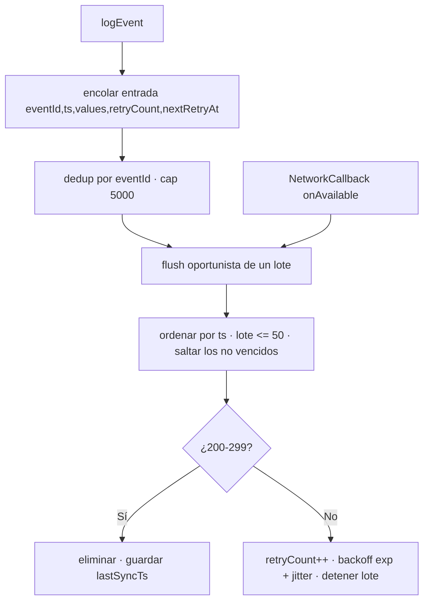

# Telemetría y Nube
{: .no_toc }

1. TOC
{:toc}

La app envía eventos a un servidor **ThingsBoard** mediante su API HTTP de
telemetría. Implementado en `lib/services/cloud/`.

## Configuración

| Clave (SharedPreferences) | Valor por defecto |
|---------------------------|-------------------|
| `cloud_base_url` | `http://200.13.5.20:8080` |
| `cloud_device_token` | *(vacío)* |

Se configuran en **Ajustes → Configuración avanzada** (la URL y el token; el token
se puede escanear por QR). Sin token, la nube está **desconfigurada** y los eventos
se descartan silenciosamente.

> **Validación de host (2026-07-13).** Guardar una URL `http://` cuyo host no esté en
> la allowlist (`200.13.5.20`) se **bloquea** en el diálogo, porque
> `network_security_config.xml` solo permite cleartext a ese host y Android
> descartaría los envíos en silencio. `https://` siempre se acepta. Añadir otro host
> HTTP exige tocar **ambos**: la allowlist Dart y `network_security_config.xml`.
{: .note }


*La sección "Cloud Sync" en Ajustes avanzados: URL base, token del dispositivo, eventos pendientes y botones Configure / Flush Queue.*

## Endpoint

```
POST {baseUrl}/api/v1/{deviceToken}/telemetry
Content-Type: application/json
```

Cuerpo (formato nativo ThingsBoard `ts`/`values`; desde **2026-07-13** la clave
canónica única es `payload` y `eventType`/`eventId` viven **dentro** de ella):

```json
{
  "ts": 1714000000000,
  "values": {
    "payload": {
      "eventId": "sync_status-1714000000000",
      "eventType": "sync_status",
      "synced": true,
      "vitals": { "avgBpm": 72, "avgSpo2": 98, "avgTemp": 34.2 }
    }
  }
}
```

- `ts` es el **inicio real de la ventana de 60 s** (epoch ms), y se conserva
  intacto en cada reintento — ThingsBoard lo usa como `entry.ts`, así que un evento
  generado offline aterriza en su día clínico real, no en el día de reconexión.
- `eventId` identifica el evento de forma estable entre reintentos
  (`<eventType>-<ts>`); el backend deduplica por él.
- `eventType`/`eventId` viven **dentro de `payload`**, no como series hermanas.
  ThingsBoard almacena una única serie `payload` y el backend **no** necesita
  correlacionar series por timestamp de recepción.
- `vitals` se omite por completo si no hay lecturas.

> **Regla de uso (backend):** solo `eventType === "sync_status"` **y**
> `payload.synced === true` suman 60 s. `synced:false`, `mission_completed`,
> `minigame_played`, y los formatos legacy (`moving`/`telemetry`/`sync_session`)
> suman 0.
{: .note }

> **Cambio de contrato (2026-07-13).** Antes cada evento se mandaba como sobre
> propio `{eventType, timestamp, payload}`, produciendo **tres series** ThingsBoard
> (`eventType`/`timestamp`/`payload`) que el backend debía re-correlacionar. Ahora
> hay una sola serie `payload`. **Requiere desplegar el backend `prosthetic-api`
> en lockstep** — un backend viejo no entiende el nuevo sobre.
{: .warning }

## Tipos de evento

| Evento | Cuándo | Carga principal |
|--------|--------|-----------------|
| `sync_status` | Por minuto (capa nativa, única fuente de verdad) | `synced` + `vitals` (`avgBpm`/`avgSpo2` y/o `avgTemp`) |
| `mission_completed` | Misión cumplida | `mission_id` |

> **Publicador único (2026-07-13).** `mission_completed` lo emite **solo** la capa
> nativa (`MissionManager.kt`), que sobrevive a la suspensión de Flutter. El
> publicador Dart duplicado se eliminó (antes ambos lados podían postear la misma
> misión). `minigame_played` y el `logSyncStatus` de Dart eran código muerto y se
> borraron.
{: .note }

> **Presencia clínica vs. visual (2026-07-13).** El conteo de segundos sincronizados
> (`syncedSecondsThisMinute`) ahora usa **presencia instantánea sin ventana de
> gracia**; la presencia suavizada de 15 s sigue alimentando UI, cuidado de mascota
> y progreso visual de misiones. Esto cumple [ADR-0007](adr/0007-truthful-telemetry-with-ux-grace.html):
> el suavizado visual no debe inflar el registro clínico. Efecto: los minutos
> sincronizados pueden leerse **algo más bajos** que antes.
{: .note }

> El evento `sync_session` (rastreador de uso duplicado, en Dart, dependía del
> engine de Flutter y sufría el mismo bug de ausencia de wakelock) se eliminó
> el 2026-07-02 — `sync_status` nativo es ahora la única fuente de verdad de
> uso. La agregación por minuto se hace en la [capa nativa](capa_nativa.html).
{: .note }

## Endpoint de tratamiento (lectura, host distinto)

Además de la telemetría (arriba, siempre *push*), la app hace **una** lectura
de datos del servidor: el tratamiento/prescripción activo del paciente.

```
GET http://200.13.5.19:3000/patients/treatment/by-device-token/{deviceToken}
```

Implementado en `lib/services/treatment/treatment_service.dart`. Usa el mismo
valor de `deviceToken` que la telemetría, pero contra un **host distinto**
(`.19`, no `.20`). Solo lectura — no existe (ni se asume) un endpoint para
escribir el progreso de vuelta. Ver `docs/adr/0011-game-allowlist-treatment-integration.md`
para el diseño completo (política de fallo abierto/cerrado, mapeo de nombres
de minijuegos, etc.).

## Cola offline y reintentos

La cola canónica vive en **`CloudManager.kt`** (capa nativa), persistida en
SharedPreferences (no Hive — ver ADR-0002). Como el nativo es la única fuente de
`sync_status`/`mission_completed`, su cola es la que importa; la `EventQueue` de
Dart quedó sin publicadores tras el cambio de 2026-07-13.



- **Flush por conectividad:** el servicio registra un `ConnectivityManager.NetworkCallback`;
  al recuperar red vacía la cola aunque no se genere un evento nuevo.
- **Lotes acotados:** hasta 50 por flush, en orden de `ts`, respetando `nextRetryAt`.
- El flush **se detiene en el primer fallo** para preservar el orden.
- **Backoff exponencial** (base 2, tope 5 min, ±20 % jitter) por entrada vía `nextRetryAt`.
- **Idempotencia:** `eventId` estable → re-encolar el mismo evento reemplaza su copia
  conservando el backoff; el backend deduplica por `eventId`.
- **Cola acotada a 5000:** al desbordar se descarta primero la entrada
  **no-`sync_status`** más antigua; `sync_status` solo se descarta como último
  recurso (y se registra), porque es lo que alimenta la regla de uso.
- Estado expuesto a la UI vía MethodChannel `sync_companion/bluetooth`
  (`getCloudQueueCount`/`getLastCloudSync`/`getLastCloudError`/`flushCloudQueue`):
  la sección Cloud Sync muestra la cola **nativa** real, no la de Dart.
- Timeout de cada POST: **5 s**.
