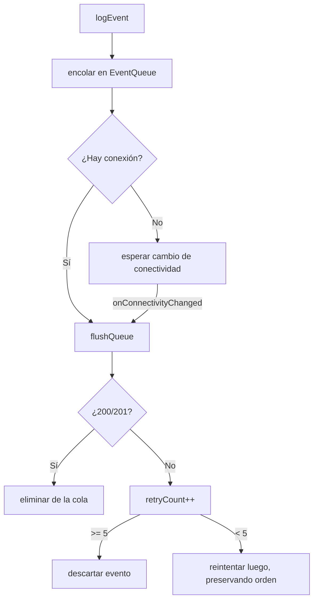

# Telemetría y Nube
{: .no_toc }

1. TOC
{:toc}

La app envía eventos a un servidor **ThingsBoard** mediante su API HTTP de
telemetría. Implementado en `lib/services/cloud/`.

## Configuración

| Clave (SharedPreferences) | Valor por defecto |
|---------------------------|-------------------|
| `cloud_base_url` | `http://200.13.5.20:8080` |
| `cloud_device_token` | *(vacío)* |

Se configuran en **Ajustes → Configuración avanzada** (la URL y el token; el token
se puede escanear por QR). Sin token, la nube está **desconfigurada** y los eventos
se descartan silenciosamente.


*La sección "Cloud Sync" en Ajustes avanzados: URL base, token del dispositivo, eventos pendientes y botones Configure / Flush Queue.*

## Endpoint

```
POST {baseUrl}/api/v1/{deviceToken}/telemetry
Content-Type: application/json
```

Cuerpo (formato ThingsBoard):

```json
{
  "ts": 1714000000000,
  "values": {
    "telemetry": "{\"event_type\":\"sync_status\", ...}"
  }
}
```

- La clave es `"mission"` para eventos `mission_completed`, y `"telemetry"` para el
  resto.
- El *payload* del evento se serializa como string JSON dentro de `values`.

## Tipos de evento

| Evento | Cuándo | Carga principal |
|--------|--------|-----------------|
| `sync_status` | Por minuto | `synced` + `vitals` (`avgBpm`/`avgSpo2` o `avgTemp`) |
| `sync_session` | Fin de sesión | `duration_seconds`, `start_time` |
| `mission_completed` | Misión cumplida | `mission_id` |
| `minigame_played` | Partida jugada | `game_id`, `score`, `play_time_seconds` |

> Las vitales se envuelven en un objeto `vitals` para un parseo consistente del
> lado del servidor. La agregación por minuto se hace en la [capa nativa](capa_nativa.html).
{: .note }

## Cola offline y reintentos

`EventQueue` (`event_queue.dart`) persiste los eventos (Hive) hasta poder
enviarlos:



- `CloudService` escucha `connectivity_plus` y hace **flush** automático al
  recuperar red.
- El flush **se detiene en el primer fallo** para preservar el orden.
- Un evento se **descarta tras 5 intentos** fallidos.
- Timeout de cada POST: **10 s**.
