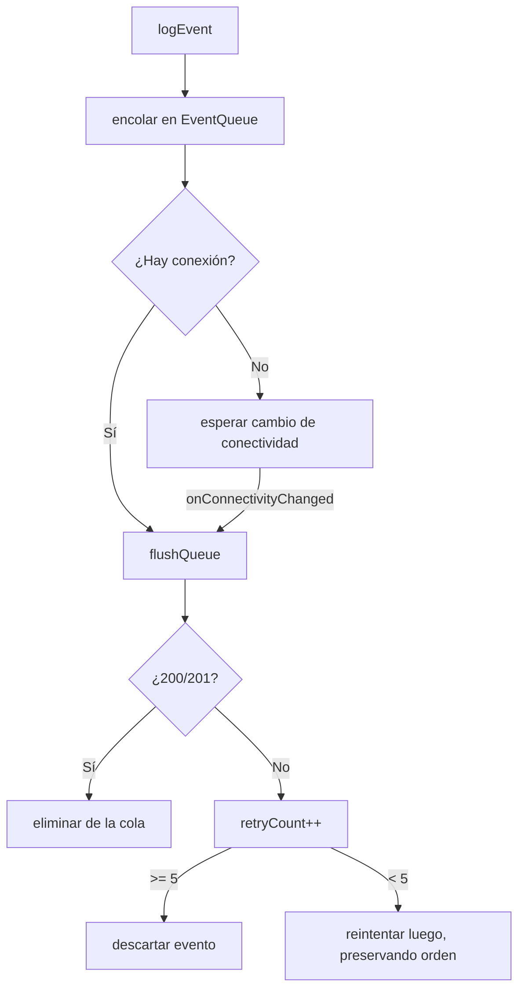

# Telemetría y Nube
{: .no_toc }

1. TOC
{:toc}

La app envía eventos a un servidor **ThingsBoard** mediante su API HTTP de
telemetría. Implementado en `lib/services/cloud/`.

## Configuración

| Clave (SharedPreferences) | Valor por defecto |
|---------------------------|-------------------|
| `cloud_base_url` | `http://200.13.5.20:8080` |
| `cloud_device_token` | *(vacío)* |

Se configuran en **Ajustes → Configuración avanzada** (la URL y el token; el token
se puede escanear por QR). Sin token, la nube está **desconfigurada** y los eventos
se descartan silenciosamente.


*La sección "Cloud Sync" en Ajustes avanzados: URL base, token del dispositivo, eventos pendientes y botones Configure / Flush Queue.*

## Endpoint

```
POST {baseUrl}/api/v1/{deviceToken}/telemetry
Content-Type: application/json
```

Cuerpo (envoltorio unificado, propio — **no** el formato `ts`/`values` de
ThingsBoard; desde 2026-07-02 el cliente nativo y el de Dart producen el mismo
JSON):

```json
{
  "eventType": "sync_status",
  "timestamp": 1714000000000,
  "payload": { "synced": true, "vitals": { "avgBpm": 72, "avgSpo2": 98 } }
}
```

- `payload` es un objeto JSON real, no un string re-serializado.
- `vitals` se omite por completo si no hay lecturas (antes Dart siempre
  mandaba `vitals: {}`).

> **Cada `eventType` es un evento y un POST independientes.** `sync_status` y
> `mission_completed` (y `minigame_played`) nunca se combinan en un mismo
> envío — solo comparten esta misma forma de sobre (`eventType`/`timestamp`/
> `payload`). Antes del 2026-07-02 el cliente nativo mandaba un sobre plano
> `{eventType: payload}` y el de Dart uno con forma ThingsBoard
> (`ts`/`values`/string doblemente codificado); se unificó la forma del sobre,
> no los eventos en sí.
{: .note }

## Tipos de evento

| Evento | Cuándo | Carga principal |
|--------|--------|-----------------|
| `sync_status` | Por minuto (capa nativa, única fuente de verdad) | `synced` + `vitals` (`avgBpm`/`avgSpo2` o `avgTemp`) |
| `mission_completed` | Misión cumplida | `mission_id` |
| `minigame_played` | Partida jugada | `game_id`, `score`, `play_time_seconds` |

> El evento `sync_session` (rastreador de uso duplicado, en Dart, dependía del
> engine de Flutter y sufría el mismo bug de ausencia de wakelock) se eliminó
> el 2026-07-02 — `sync_status` nativo es ahora la única fuente de verdad de
> uso. La agregación por minuto se hace en la [capa nativa](capa_nativa.html).
{: .note }

## Endpoint de tratamiento (lectura, host distinto)

Además de la telemetría (arriba, siempre *push*), la app hace **una** lectura
de datos del servidor: el tratamiento/prescripción activo del paciente.

```
GET http://200.13.5.19:3000/patients/treatment/by-device-token/{deviceToken}
```

Implementado en `lib/services/treatment/treatment_service.dart`. Usa el mismo
valor de `deviceToken` que la telemetría, pero contra un **host distinto**
(`.19`, no `.20`). Solo lectura — no existe (ni se asume) un endpoint para
escribir el progreso de vuelta. Ver `docs/adr/0011-game-allowlist-treatment-integration.md`
para el diseño completo (política de fallo abierto/cerrado, mapeo de nombres
de minijuegos, etc.).

## Cola offline y reintentos

`EventQueue` (`event_queue.dart`) persiste los eventos en **SharedPreferences**
(no Hive — Hive fue eliminado del proyecto, ver ADR-0002) hasta poder
enviarlos:



- `CloudService` escucha `connectivity_plus` y hace **flush** automático al
  recuperar red.
- El flush **se detiene en el primer fallo** para preservar el orden.
- Un evento se **descarta tras 5 intentos** fallidos.
- Timeout de cada POST: **10 s**.
